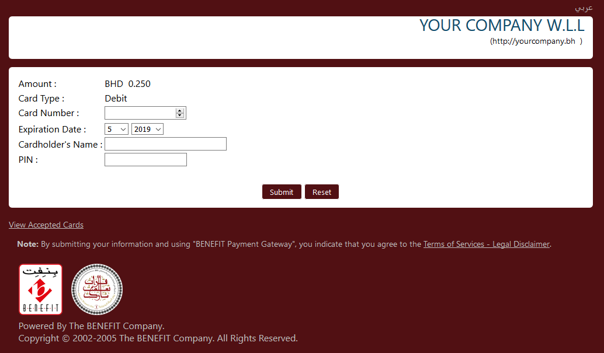
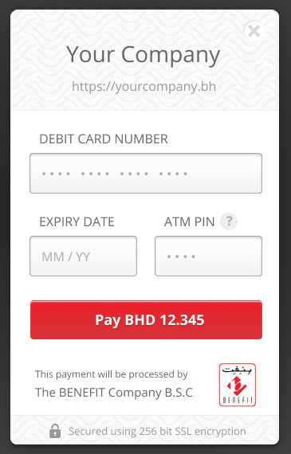

> Congratulations! You just found the *easiest* way to integrate with the BENEFIT payment system in Bahrain!

## 👋 About

BenefitJS¹ is a simple, open-source library that allows you to accept BENEFIT payments through a modern, reliable interface that is optimized around the User Experience. 

It was born out of a frustration with the verbose, cryptic and unappealing integration process that comes standard with BENEFIT integrations.

BenefitJS provides:
- 📱 A stunning **mobile-first** user experience that massively improves upon the default Benefit integration
- 🙌 **Same-page checkout** (finally!) using a sleek, modern modal dialog
- 😍 Additional features, including support for one-click checkout (or "Tokenization", in payments lingo)
- 📧 **Premium support**, available to Enterprise customers (more [below](#-premium-support))

## 👉 How it looks

This is what the default (and rather distasteful) Benefit integration looks like:



.. and here's what the BenefitJS checkout page looks like:



## ⚡ Getting Started

This project consists of two main parts:

1. An `index.js` that creates an `<iframe>` in the parent window, or opens a separate window on mobile devices.
2. Checkout, a Vue application with the actual Checkout form, is added as a submodule at [`inner/`](https://github.com/benefit-js/inner/tree/). 

Since the two projects are tightly coupled, we track them jointly through this repository.

### Using Benefit.js

To integrate using Benefit.js, you'll need an account with BENEFIT. If you don't already have one, [sign up for a BENEFIT account through Credimax](https://www.credimax.com.bh/en/e_payment_gateway)

Assuming you have an account, you can now:

1. Register for a BenefitJS account at [https://benefitjs.com](https://benefitjs.com/?utm_source=github)
2. Upload your `resource.cgn` file to the Dashboard, and receive your public key.
3. Integrate BenefitJS into your website using the sample code below:

```html
<form action="/pay" method="POST">
  <script 
    src="https://fast.benefitjs.com"
    data-key="key_..."
    data-transaction-id="19201"
    data-amount="12.345">
  </script>
  <!-- renders 'pay' button, submits form when done -->
</form>
```

<details>
<summary>Interested in more finer-grained control of the checkout? Then <strong>custom mode is for you!</strong></summary>
<pre style="white-space:nowrap">
const benefitHandler = new BenefitJS({
  key: 'key_...',
  transactionId: 'Order 12910',
  amount: 1.234, // BHD
  onClose: () => {
    console.warn('onClose() called')
  },
  onCancel: () => {
    console.warn('onCancel() called')
  },
  onComplete: () => {
    console.info('onComplete() called')
  }
})
</pre>
</details>

For a complete list of `data-` params, see the [Supported options](#supported-options) section below.

### First-time local setup

1. Create a `.env.development` file with the following keys:
    - `CHECKOUT_URL=http://localhost:8080`, or whatever the local server URL is for your [`inner`](https://github.com/benefit-js/benefit-js) repository
    - `DEBUG_MODE=true`, to enable debug messages in the browser console
2. Run `yarn run serve`

This should open up the `demo.html` file in your browser. Editing the `index.js` script should automagically reload your browser and keep things in sync!

To update to the latest version of `inner`, simply run `git submodule update --remote` from the `inner/` directory.

### Deployment

The wrapper `index.js` script is deployed to `https://fast.benefitjs.com/benefit.js`, our global static CDN-hosted endpoint. 

Checkout is deployed at a separate endpoint at `https://checkout.benefitjs.com/`.

## 📩 Premium Support

Enterprise users are welcome to contact us at [sales@benefitjs.com](mailto:sales@benefitjs.com) for priority support plans for your organization. All other users may open an issue on this repository.

# Documentation

## Supported Options

Below is a comprehensive list of the common options supported by the BenefitJS library for both integration types (simple and custom):

| Key | Required? | Description | Sample |
|---|---|:--|:--|
| `key` / `data-key` | **Required** | The public key that uniquely identifies you as a seller. You can get this key from the [BenefitJS dashboard](https://benefitjs.com) | `89b51c9e-9338-11e9-9cc3-0242ac110003` |
| `transactionId` / `data-transaction-id` | **Required** | Any unique character sequence that can be used to identify this order. Usually something your backend generates | `Order-1234` |
| `amount` / `data-amount` | **Required** | The amount that the customer will pay for the order, in BHD. This is a decimal value | `1.234` *= BHD 1.234* |
| `title` / `data-title` | *optional* | The title shown on top of the payment page. Great place to put the seller name | `Batelco`. Default is `Pay with BENEFIT` |
| `subtitle` / `data-subtitle` | *optional* | Displayed directly under the title on the payment page. Great place to include a description of the items being purchased. |  `Bill payment for 3999 9999`. Default is ` ` (empty) |

### Simple-only options

The options below are only supported by the Simple integration:

| Option | Required? | Description |
|---|---|---| 
| `data-button-text` | *optional* | The text shown on the "Pay Now" button that is generated. Defaults to `Pay by Debit Card` |

### Custom-only options

The Custom integration supports the following callbacks:

| Option | Required? | Description |
|---|---|---| 
| `onCancel` | *optional* | Function that is called when the payment dialog is cancelled by the user.
| `onComplete` | *optional* | Function that is called when the payment is successfully completed.
| `onClose` | *optional* | The function that is called when the modal dialog is closed. This is **always** triggered on modal close, regardless of the underlying reason (e.g. user cancellation or payment completion).

¹ **Note:** BenefitJS is not affiliated with The BENEFIT Company in Bahrain. This open source library is provided by contributors to help improve the payment experience for customers and companies in Bahrain. 

If you would like to contribute to this project, please review the CONTRIBUTING guidelines.
